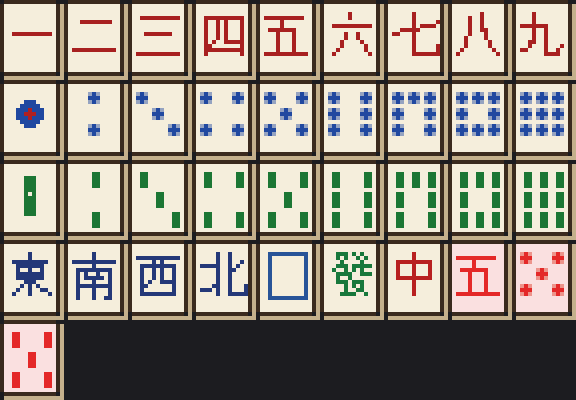

# majong_plugin

在 Minecraft 伺服器上打日本麻將（立直麻雀）的 Paper 外掛。四家一桌，從聊天欄點牌出牌，
支援吃碰槓、立直、振聽、寶牌與裏寶牌、役滿，並照日本麻雀的符計算與點數表結算。


- **伺服器**：Paper `26.1.2`
- **Java**：25
- **指令**：`/mahjong`（別名 `/mj`、`/majong`、`/riichi`）

## 建置

```bash
mvn package
```

產出 `target/MajongPlugin-1.1.0.jar`，丟進伺服器的 `plugins/` 重開即可。

## 開一局

```
/mj create mytable     # 開桌
/mj bots               # 空位補電腦玩家
/mj start              # 四家坐滿後開局
```

想跟人打就讓其他玩家 `/mj join mytable`，湊滿四家再 `/mj start`。

輪到你時，手牌會顯示在聊天欄，**直接點牌就會打出去**；可以鳴牌時會出現
`[ポン] [チー] [ロン] [スルー]` 之類的按鈕。也可以打字：

| 指令 | 說明 |
| --- | --- |
| `/mj discard <牌>` | 打牌，例如 `/mj discard 3m` |
| `/mj riichi <牌>` | 立直並打出該牌 |
| `/mj tsumo` / `/mj ron` | 自摸 / 榮和 |
| `/mj pon` / `/mj chi <牌> <牌>` / `/mj kan <牌>` | 碰 / 吃 / 槓 |
| `/mj pass` | 跳過鳴牌 |
| `/mj kyuushu` | 九種九牌流局 |
| `/mj hand` | 重新顯示手牌 |
| `/mj info` | 看場況、各家分數與牌河 |
| `/mj list` / `/mj leave` | 列出牌桌 / 離桌 |
| `/mj style <auto\|tiles\|text>` | 切換牌圖或文字顯示 |
| `/mj preview [大小] [間距]` | 在世界裡放測試用的立體牌 |
| `/mj table` | 把牌桌放在你站的位置 |

牌的寫法：`1m`–`9m` 萬子、`1p`–`9p` 筒子、`1s`–`9s` 索子、
`1z`–`7z` 東南西北白發中、`0m`/`0p`/`0s` 赤五。

逾時（預設 30 秒）沒動作時，系統會替你摸切或跳過鳴牌。

## 牌面

外掛附帶一份資源包，把 34 種牌加上三張赤五畫成聊天欄字型（`U+E000`–`U+E024`）。
沒有資源包的玩家會自動退回彩色文字（`3m`、`東`），不會看到方塊亂碼。



萬子是紅色漢字數字、筒子是藍點、索子是綠竹、字牌直接寫字，赤五用粉紅底色標示。
圖是用 `tools/generate_tiles.py` 產生的（需要 Pillow 與 WenQuanYi Zen Hei，
字牌的漢字取自它的 12px 點陣字形），改牌面只要改腳本再跑一次。

### 讓玩家看到牌圖

外掛啟動時會把資源包寫成 `plugins/MajongPlugin/majong-tiles.zip`，並在 log 印出 SHA-1：

```
[MajongPlugin] Tile resource pack written to plugins/MajongPlugin/majong-tiles.zip (sha1 3179...)
```

把這個 zip 放到玩家能下載的地方，再把網址與 SHA-1 填進 config：

```yaml
tile-graphics: auto
resource-pack:
  url: 'https://example.com/majong-tiles.zip'
  sha1: '<照 log 印出來的那串填>'
  required: false
```

玩家進伺服器時就會收到資源包詢問，接受後自動切成牌圖。
`tile-graphics: text` 可以整台伺服器關掉牌圖，個別玩家則用 `/mj style`。

**只是想自己試一下**的話不用架站台：把 `majong-tiles.zip` 直接丟進 Minecraft 客戶端的
`resourcepacks/` 資料夾，在遊戲的「選項 → 資源包」啟用就好。

### 已經有其他資源包？

不用取捨，兩個可以疊著用。這份資源包只新增 `assets/majong/` 底下的檔案，
沒有覆蓋任何原版或別人的素材，所以不會衝突，套用順序也無所謂。

- **客戶端**：兩個 zip 都丟進 `resourcepacks/`，在「選項 → 資源包」把兩個都移到右邊啟用。
- **伺服器推送**：外掛用 `addResourcePack` 附加，不會把伺服器原本推送的資源包踢掉，
  客戶端會同時收到多份並依序套用。

### 世界裡的牌桌

資源包裡同時附了 38 個立體牌模型（`assets/majong/models/item/tile_*.json`，
用 `minecraft:item_model` 元件選用）。開局時牌桌會出現在開桌者站的位置，
四家各自圍著中心排開，**右鍵點自己的牌就是打出去**。

你只看得到自己的手牌，別人那三家對你顯示牌背——每張牌其實畫了兩次，
正面只給持有者看、背面只給其他人看，所以繞到別人背後也偷看不到。

`/mj table` 可以把牌桌移到你站的位置，`/mj preview <大小> <間距>` 可以試不同的尺寸。
桌子的半徑、高度、牌的大小與間距都能在 config 的 `table:` 區塊調。


## 設定

`plugins/MajongPlugin/config.yml`：

```yaml
turn-timeout-seconds: 30    # 思考時間
bot-delay-ticks: 12         # 電腦玩家出牌間隔
next-hand-delay-seconds: 6  # 下一局開始前的間隔
tile-graphics: auto         # auto / tiles / text，見「牌面」一節
rules:
  game-length: hanchan      # hanchan 半莊 / tonpuusen 東風戰
  starting-points: 25000
  red-fives: true           # 赤五
  head-bump: true           # 頭跳（只有最靠近放銃者能和）
  end-on-bankruptcy: true   # 有人被打飛就結束
```

改完 `/mj reload` 生效（需要 `majong.admin` 權限）；已開始的對局沿用開局時的規則。

## 已實作的規則

**和牌型**：四面子一雀頭、七對子、國士無雙。

**役**：立直、一発、門前清自摸和、平和、断幺九、一盃口、役牌（白發中／自風／場風）、
嶺上開花、搶槓、海底摸月、河底撈魚、ダブル立直、七対子、三色同順、一気通貫、
混全帯幺九、混老頭、対々和、三暗刻、三色同刻、三槓子、小三元、混一色、純全帯幺九、
二盃口、清一色。

**役滿**：国士無双（十三面倍役滿）、四暗刻（単騎倍役滿）、大三元、小四喜、大四喜（倍）、
字一色、清老頭、緑一色、九蓮宝燈（純正倍役滿）、四槓子、天和、地和、数え役満。

**計算**：符計算（門前加符、自摸符、待ち符、雀頭符、明暗刻槓符、食い平和 30 符、
七対子 25 符）、滿貫以上的階梯、莊家／閒家的榮和與自摸分配、本場與供託。
牌型有多種解釋時（例如 `111222333m`）會全部展開取最高分。

**流局**：荒牌平局的聽牌料與連莊、九種九牌、四家立直、四槓散了、四風連打。

**其他**：寶牌／槓寶牌／裏寶牌／赤寶牌、振聽（同巡・永久・立直後）、
立直後只能摸切、立直中的暗槓限制（不能變聽）、搶槓。

### 目前的簡化

- 採頭跳制，不處理雙榮／三榮的分配（三家同時榮和時流局）。
- 未實作食替（吃碰後打出同一張）的禁止、流し満貫、責任払い。
- 槓寶牌一律在槓宣告後立即翻開（含大明槓）。

## 專案結構

```
com.majong.riichi.core    牌、牌山、手牌、和牌判定、役、符、點數（不依賴 Bukkit）
com.majong.riichi.game    對局引擎：摸打、鳴牌、立直、流局、連莊
com.majong.riichi.bot     電腦玩家
com.majong.riichi.plugin  Paper 外掛：牌桌、指令、聊天欄介面
tools/generate_tiles.py   產生牌面圖與資源包
```

`core` 與 `game` 完全不依賴伺服器 API，可以單獨拿去用。

## 測試

```bash
mvn test
```

包含符與點數的對照測試、和牌判定、向聽數，以及隨機打完整半莊、檢查點數守恆的對局測試。
